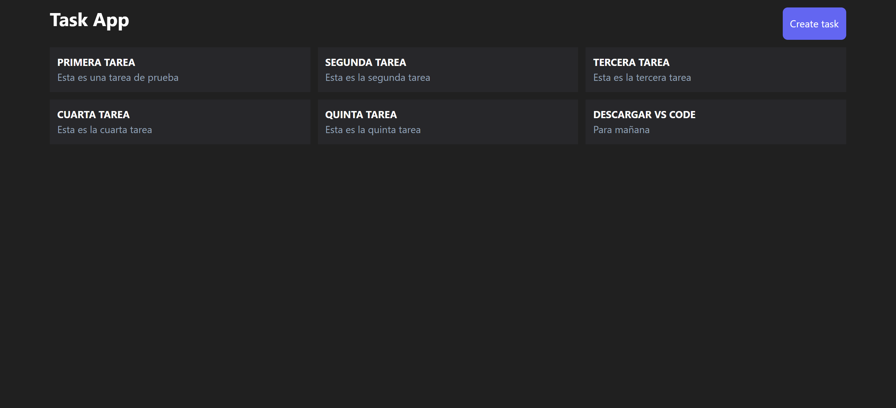
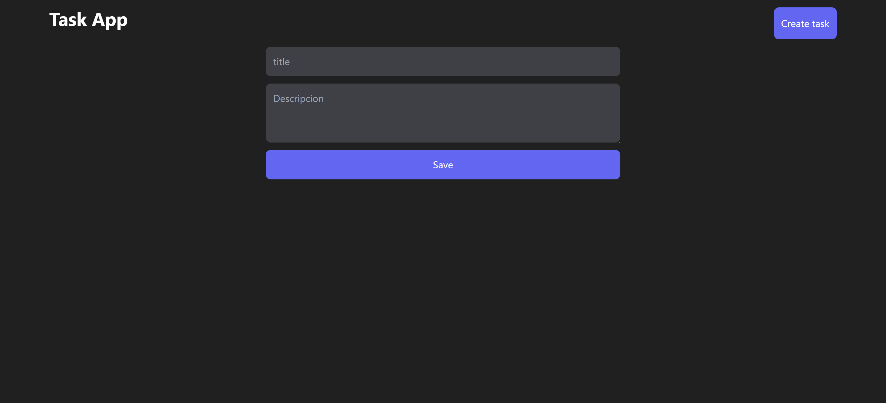
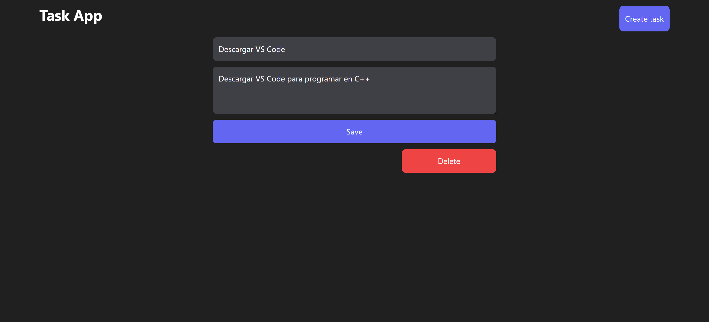

# Task List App



## Descripción / Description

Esta aplicación es una lista de tareas (Task List) que permite a los usuarios crear, leer, actualizar y eliminar tareas (CRUD). Está construida con Django Rest Framework en el backend y React con Vite en el frontend.

This application is a Task List that allows users to create, read, update, and delete tasks (CRUD). It is built with Django Rest Framework on the backend and React with Vite on the frontend.

## Características / Features

- Crear una nueva tarea / Create a new task
- Leer todas las tareas / Read all tasks
- Actualizar una tarea existente / Update an existing task
- Eliminar una tarea / Delete a task

## Capturas de Pantalla / Screenshots

### Lista de Tareas / Task List


### Crear Tarea / Create Task



### Actualizar/Eliminar Tarea / Update/Delete Task



## Requisitos / Requirements

- Python 3.x
- Node.js
- npm o yarn / npm or yarn

## Configuración y Ejecución / Setup and Execution

### Backend (Django)

1. Clona el repositorio / Clone the repository:
    ```sh
    git clone https://github.com/JCEspitia/django-crud-react.git
    ```

2. Crea y activa un entorno virtual (opcional pero recomendado) / Create and activate a virtual environment (optional but recommended):
    ```sh
    python -m venv venv
    source venv/bin/activate  # En Windows usa `venv\Scripts\activate` / On Windows use `venv\Scripts\activate`
    ```

3. Instala las dependencias del backend / Install the backend dependencies:
    ```sh
    pip install -r requirements.txt
    ```

4. Aplica las migraciones / Apply the migrations:
    ```sh
    python manage.py migrate
    ```

5. Inicia el servidor de desarrollo de Django / Start the Django development server:
    ```sh
    python manage.py runserver
    ```

### Frontend (React con Vite / React with Vite)

1. Abre una nueva terminal y navega al directorio del frontend / Open a new terminal and navigate to the frontend directory:
    ```sh
    cd client
    ```

2. Instala las dependencias del frontend / Install the frontend dependencies:
    ```sh
    npm install  # O usa `yarn` si prefieres / Or use `yarn` if you prefer
    ```

3. Inicia el servidor de desarrollo de Vite / Start the Vite development server:
    ```sh
    npm run dev  # O `yarn dev`
    ```

## Uso / Usage

Una vez que ambos servidores estén en funcionamiento, abre tu navegador y navega a `http://localhost:3000` para interactuar con la aplicación de tareas.

Once both servers are running, open your browser and navigate to `http://localhost:3000` to interact with the Task List application.

## API

La API de la aplicación sigue los estándares REST y puede ser utilizada para realizar operaciones CRUD sobre las tareas.

The application's API follows REST standards and can be used to perform CRUD operations on tasks.

### Endpoints

- `GET /tasks/api/v1/tasks/` - Obtener todas las tareas / Get all tasks
- `POST /tasks/api/v1/tasks/` - Crear una nueva tarea / Create a new task
- `GET /tasks/api/v1/tasks/:id/` - Obtener una tarea específica / Get a specific task
- `PUT /tasks/api/v1/tasks/:id/` - Actualizar una tarea existente / Update an existing task
- `DELETE /tasks/api/v1/tasks/:id/` - Eliminar una tarea / Delete a task

## Contribuir / Contributing

Las contribuciones son bienvenidas. Por favor, abre un issue o envía un pull request para discutir cualquier cambio que quieras hacer.

Contributions are welcome. Please open an issue or submit a pull request to discuss any changes you would like to make.

## Licencia / License

Este proyecto está bajo la licencia MIT. Consulta el archivo [LICENSE](LICENSE) para más detalles.

This project is licensed under the MIT License. See the [LICENSE](LICENSE) file for details.
